# Figure inventory

Saved historical figures; embedded notebook snapshots are retained for viewing without local files.

## IAE_vs_flatness

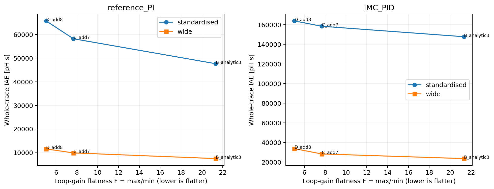

[PNG](output/compensation_vs_tracking/IAE_vs_flatness.png) | [PDF](output/compensation_vs_tracking/IAE_vs_flatness.pdf)

## IAE_vs_loop_gain

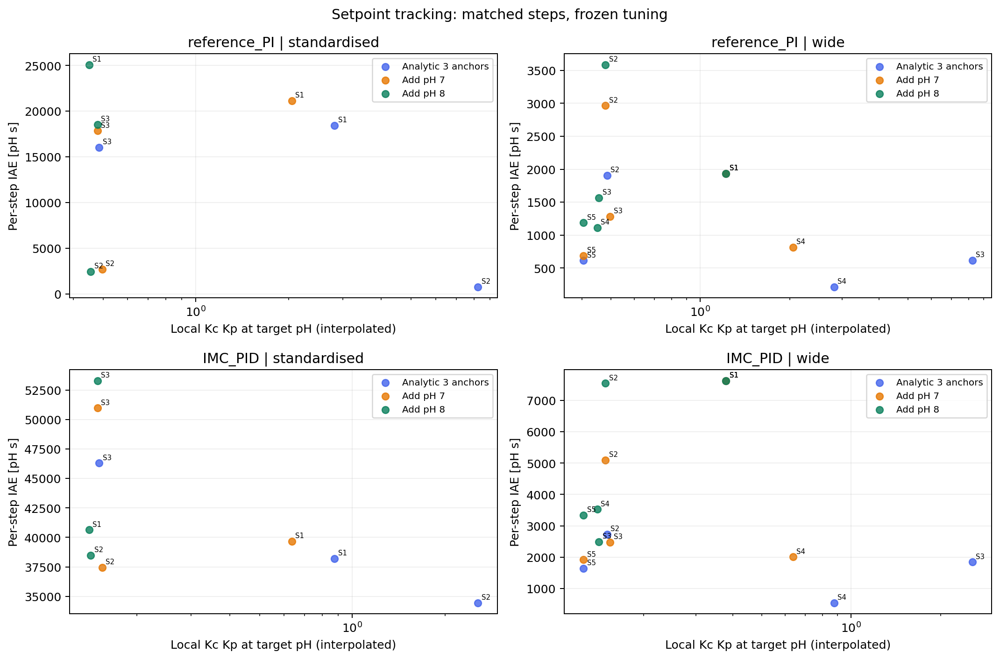

[PNG](output/compensation_vs_tracking/IAE_vs_loop_gain.png) | [PDF](output/compensation_vs_tracking/IAE_vs_loop_gain.pdf)

## IAE_vs_pH

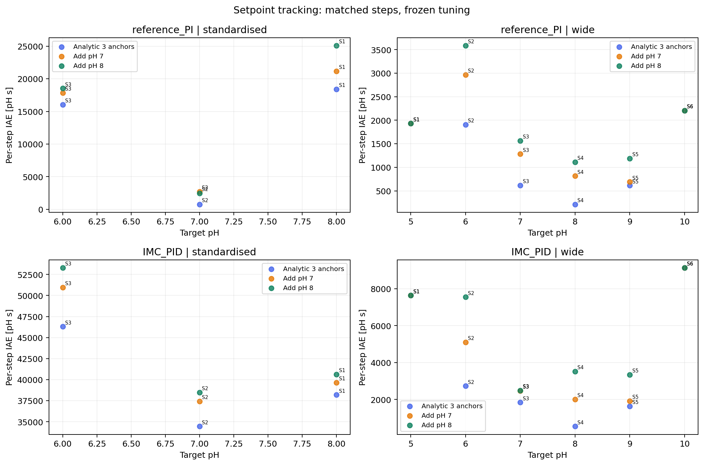

[PNG](output/compensation_vs_tracking/IAE_vs_pH.png) | [PDF](output/compensation_vs_tracking/IAE_vs_pH.pdf)

## loop_gain_vs_pH

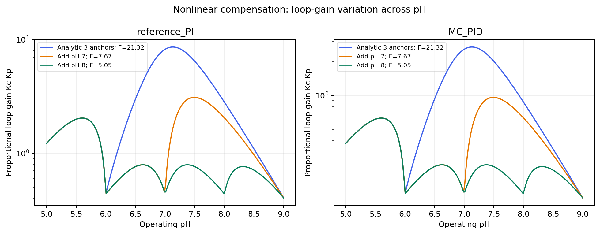

[PNG](output/compensation_vs_tracking/loop_gain_vs_pH.png) | [PDF](output/compensation_vs_tracking/loop_gain_vs_pH.pdf)

## loop_gain_flatness

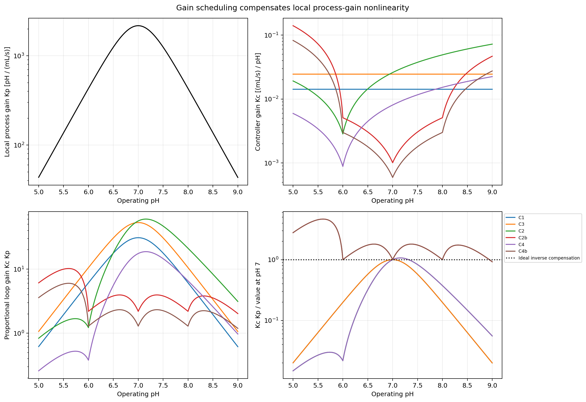

[PNG](output/loop_gain_flatness/loop_gain_flatness.png) | [PDF](output/loop_gain_flatness/loop_gain_flatness.pdf)

## original_ablation

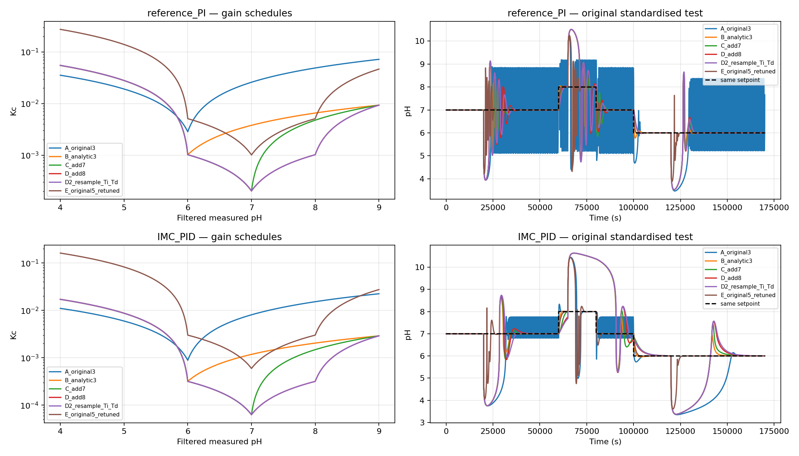

### Lab_Scale_CSTR_Simulation_2_corrected, cell 9

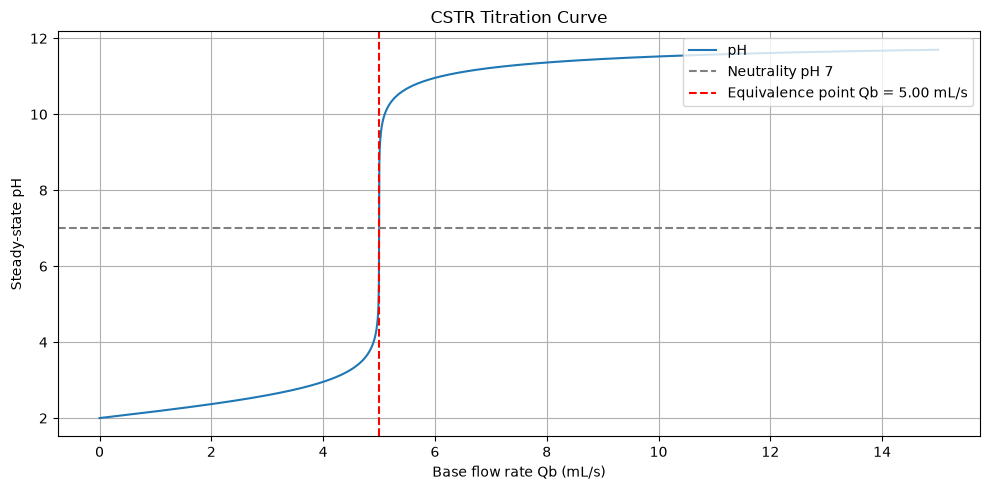

### Lab_Scale_CSTR_Simulation_2_corrected, cell 11

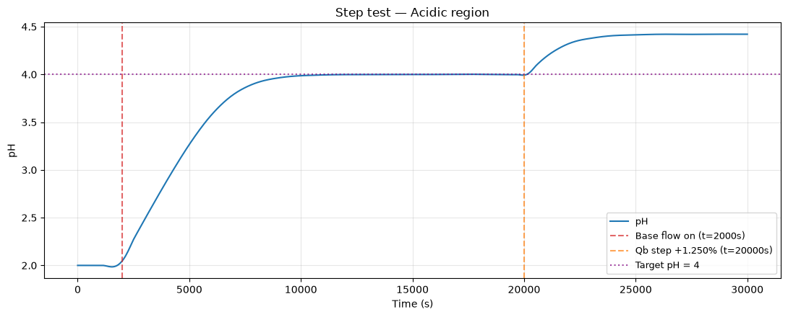

### Lab_Scale_CSTR_Simulation_2_corrected, cell 12

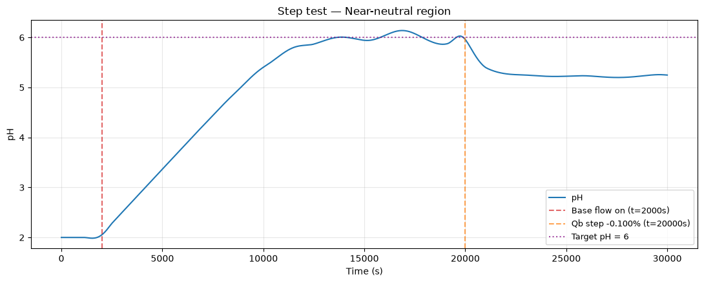

### Lab_Scale_CSTR_Simulation_2_corrected, cell 13

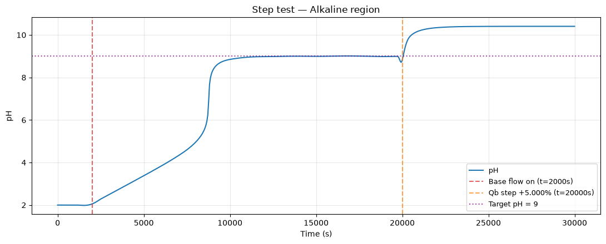

### Lab_Scale_CSTR_Simulation_2_corrected, cell 17

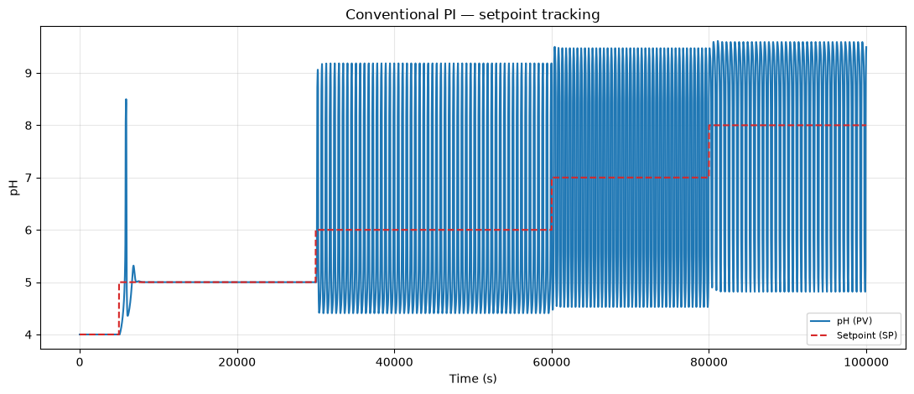

### Lab_Scale_CSTR_Simulation_2_corrected, cell 18

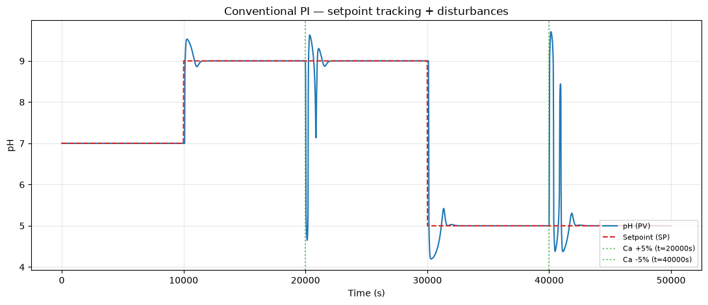

### Lab_Scale_CSTR_Simulation_2_corrected, cell 23

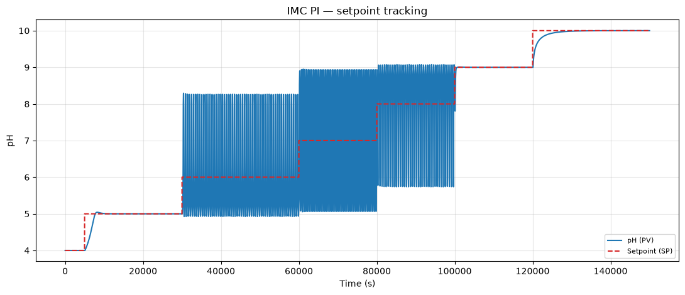

### Lab_Scale_CSTR_Simulation_2_corrected, cell 24

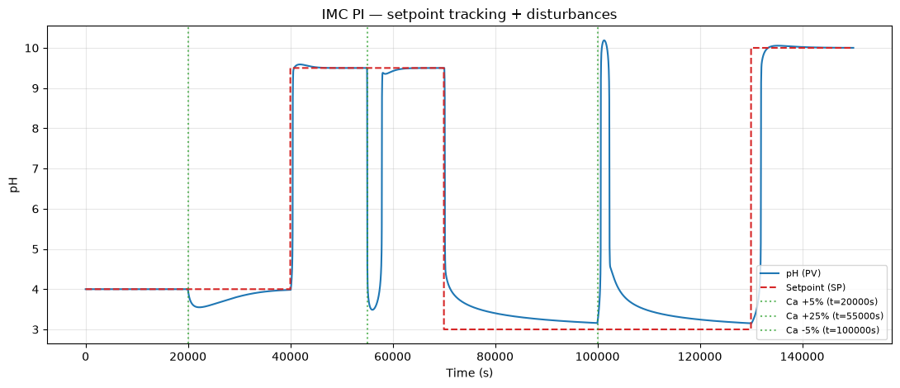

### Lab_Scale_CSTR_Simulation_2_corrected, cell 27

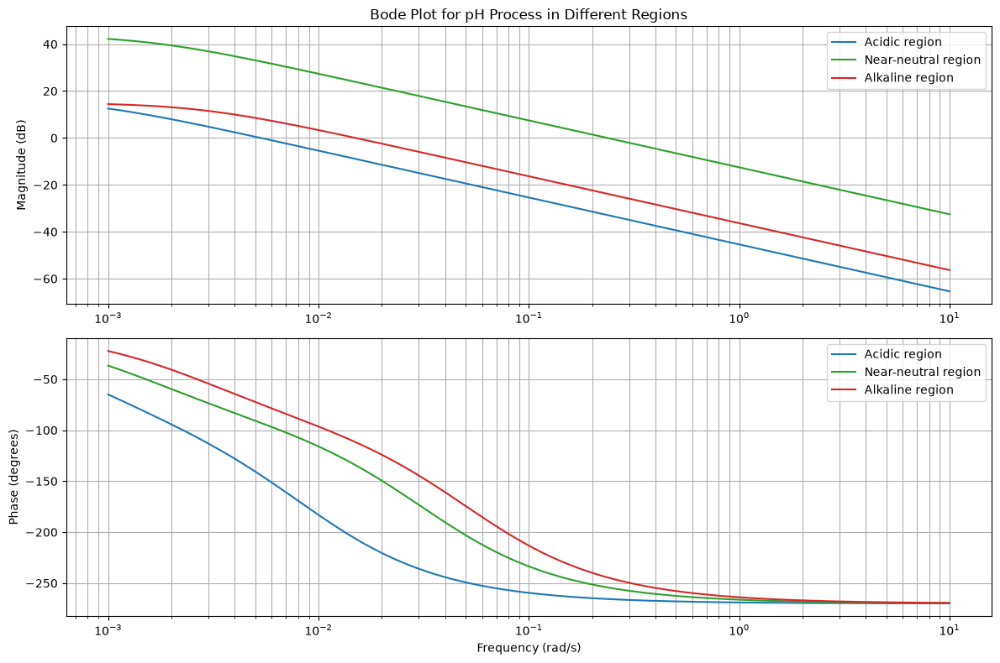

### Lab_Scale_CSTR_Simulation_2_corrected, cell 32

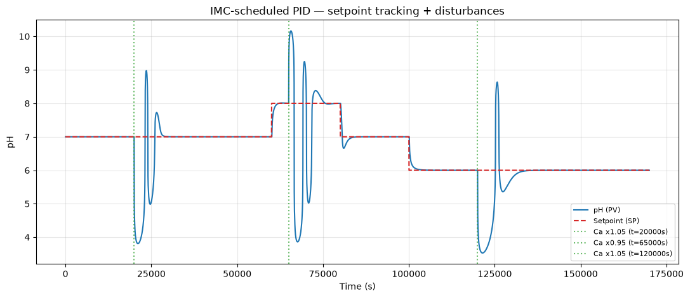

### Lab_Scale_CSTR_Simulation_2_corrected, cell 32

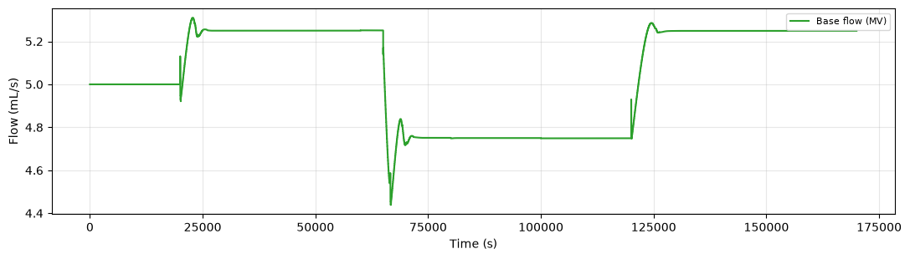

### Lab_Scale_CSTR_Simulation_2_corrected, cell 33

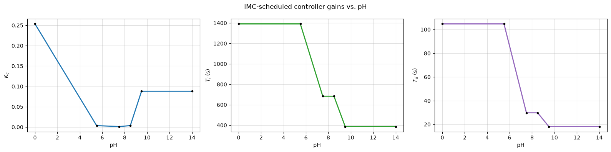

### Lab_Scale_CSTR_Simulation_2_corrected, cell 40

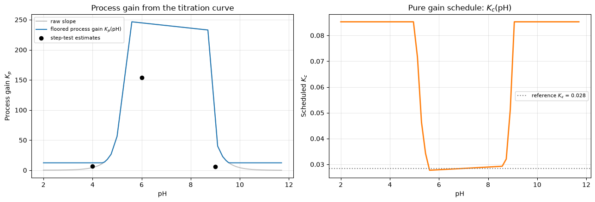

### Lab_Scale_CSTR_Simulation_2_corrected, cell 42

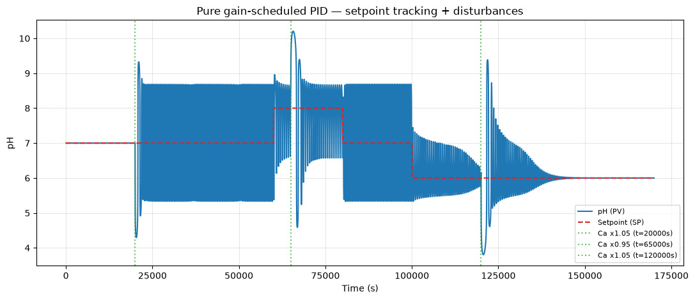

### Lab_Scale_CSTR_Simulation_2_corrected, cell 42

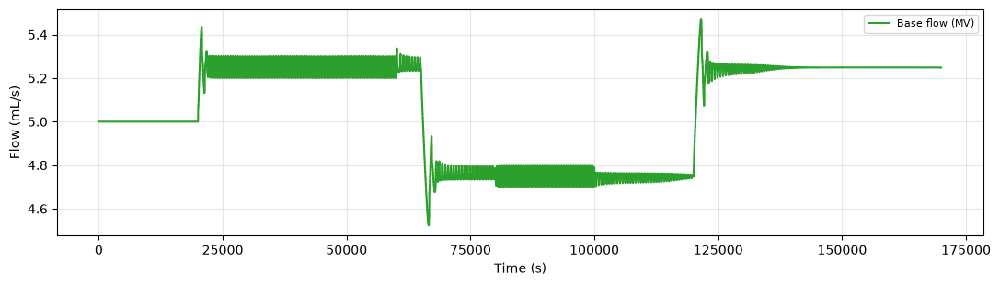

### Lab_Scale_CSTR_Simulation_2_corrected, cell 88

